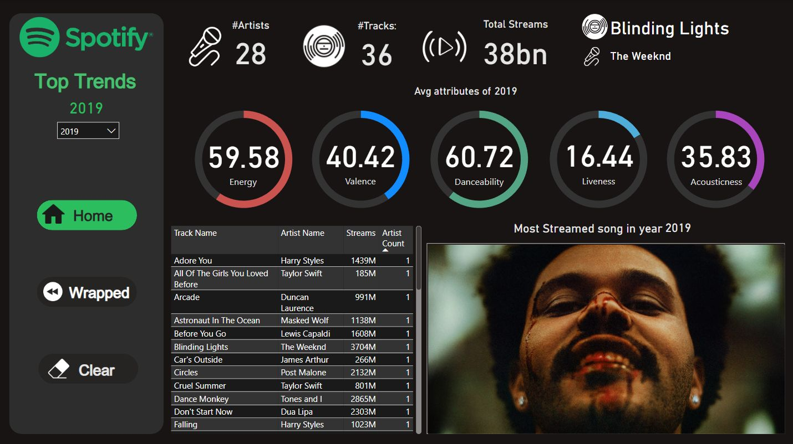
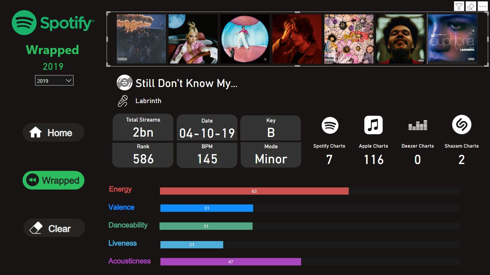

# 🎵 Spotify Global Metrics Dashboard

## 📌 Overview
This project is a comprehensive data analysis of Spotify's global top tracks, designed to identify key drivers of song popularity. It demonstrates a full **Data Analysis Lifecycle**:
1.  **Extraction:** Scraped and compiled raw music data using **Python**.
2.  **Transformation (ETL):** Cleaned and structured large-scale datasets using **Pandas** and **Power Query**.
3.  **Visualization:** Built an interactive **Power BI** dashboard to uncover trends in audio attributes (Energy, Valence, BPM) and cross-platform performance.

---

## 📊 Dashboard Visuals

### 1. Audio Feature Analysis
*Analyzes the correlation between musical attributes like Energy, Valence, and Danceability in top-performing songs of that year*

### 2. Wrapped Section
*Data about top 10 songs of that year in a Spotify Wrapped style demographic*

---

## 🛠️ Tech Stack & Methodology

* **Data Extraction:** Python (Requests, BeautifulSoup/API)
* **Data Cleaning:** Pandas, SQL, Power Query
* **Visualization:** Power BI
* **Analytics:** DAX (Data Analysis Expressions) for complex KPIs
* **Key Metrics:** Valence, Energy, Danceability, Acoustics, BPM

---

## 🔍 Key Insights
* **BPM Trends:** Identified a shift in the average tempo of hit songs over the last decade, correlating with changing genre preferences.
* **Platform Correlation:** Analyzed how performance on Spotify correlates with presence on other streaming platforms.
* **Attribute Impact:** Visualized how "Energy" and "Valence" scores impact a song's likelihood of entering the Top 50 Global chart.

---

## 🚀 How to Use
1.  **Clone the Repository:**
2.  **View the Dashboard:**
    * Open `Spotify Data Dashboard.pbix` in **Power BI Desktop**.
    * *Note: Screenshots are provided above for quick viewing without software installation.*
3.  **Run the ETL Script:**
    * Run `Spotify.py` to see the extraction logic.

---

## 📬 Contact
* **Megh Modi**
* [LinkedIn Profile]((https://www.linkedin.com/in/megh-modi-79764122b))
* [Email](mailto:meghmodi2004@gmail.com)
